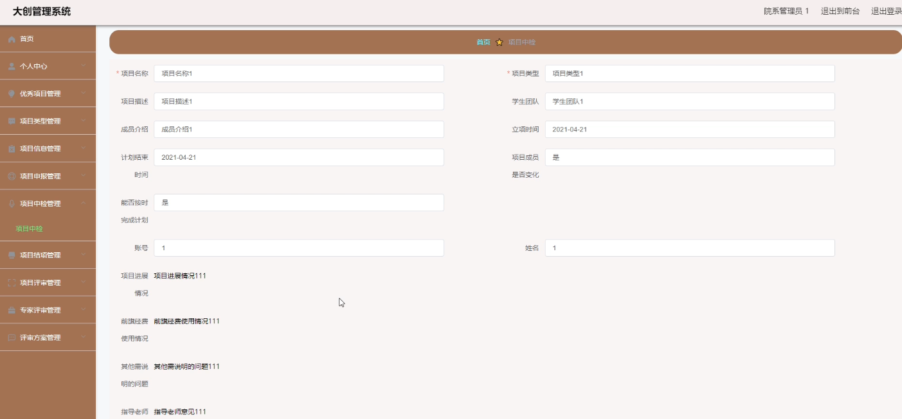

基于Springboot的大创管理系统（程序+论文）
=
### 完整代码获取地址：从戎源码网 ([https://armycodes.com/](https://armycodes.com/))
### 作者微信：19941326836  QQ：952045282 
### 承接计算机毕业设计、Java毕业设计、Python毕业设计、深度学习、机器学习
### 选题+开题报告+任务书+程序定制+安装调试+论文+答辩ppt 一条龙服务
### 所有选题地址https://github.com/nature924/allProject

一、项目介绍
---
系统包含两种角色：用户、管理员，系统分为前台和后台两大模块，主要功能如下：

### 1管理员模块的实现
- 项目中检管理  
  系统管理员可以对项目中检信息进行管理，包括添加、修改、删除以及查询操作。

- 专家评审管理  
  系统管理员可以对专家评审信息进行管理，包括添加、修改、删除以及查询操作。

### 2 指导老师模块的实现
- 项目申报管理  
  指导老师可以对项目申报信息进行管理，包括修改、删除以及查询操作。

- 项目结项管理  
  指导老师可以对项目结项信息进行修改操作，还可以查询项目结项信息。

### 3学生模块的实现
- 学生注册管理  
  学生在注册后才能登录系统。

- 优秀项目信息  
  学生登录后可以查看优秀项目的详细信息。

- 项目信息申报  
  学生可以在个人中心的项目信息管理中进行项目申报。

二、项目技术
---
- 编程语言：Java
- 数据库：MySQL
- 项目管理工具：Maven
- 前端技术：VUE、HTML、Jquery、Bootstrap
- 后端技术：Spring、SpringMVC、MyBatis

三、运行环境
---
- 操作系统：Windows、macOS都可以
- JDK版本：JDK1.8以上都可以
- 开发工具：IDEA、Ecplise、Myecplise都可以
- 数据库: MySQL5.7以上都可以
- Tomcat：任意版本都可以
- Maven：任意版本都可以

四、运行截图
---
### 论文截图：

### 程序截图：

